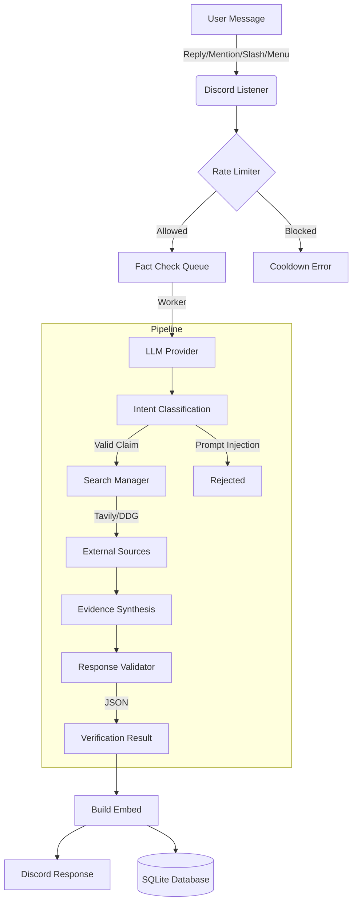

<p align="center">
  <a href="https://github.com/Microck/nagrom">
    
  </a>
</p>

<p align="center">nagrom is a self-hostable discord bot designed for rigorous fact-checking against a tiered hierarchy of trusted sources. </p>

<p align="center">
  <a href="LICENSE"></a>
  <a href="https://www.python.org/"></a>
  <a href="https://github.com/Rapptz/discord.py"></a>
</p>

---

### quickstart

**Option 1: GUI Setup (Recommended)**

```bash
# clone the repo
git clone https://github.com/microck/nagrom.git
cd nagrom

# setup venv
python -m venv .venv
# Activate: 
# Windows: .\.venv\Scripts\Activate.ps1
# Linux/Mac: source .venv/bin/activate

# install dependencies
pip install -r requirements.txt

# Run the setup wizard
python setup_gui.py
```
This will open a browser tab at `http://127.0.0.1:8080` where you can configure your tokens, providers, and settings easily.
**Note:** For security, the GUI is bound to `localhost` to prevent unauthorized network access.

<!-- SCREENSHOT: Web Configuration GUI showing provider settings -->

**Option 2: Manual Setup**

```bash
# copy example config
cp config/examples/minimal.yaml config/bot.yaml
# edit bot.yaml with your keys

# run it
python -m src
```

---

### table of contents

*   [features](#features)
*   [how it works](#how-it-works)
*   [installation](#installation)
*   [configuration](#configuration)
*   [docker](#docker)
*   [security](#security)
*   [usage](#usage)
*   [commands](#commands)
*   [troubleshooting](#troubleshooting)

---

### features

nagrom isn't a wrapper around an llm. it enforces a specific logic loop to verify facts.

*   **bring your own key (BYOK):** supports Google AI Studio, OpenRouter, OpenAI, Anthropic, or generic OpenAI-compatible endpoints.
*   **smart retrieval:** searches the web using **Tavily** (recommended) or **DuckDuckGo** to find real-time evidence.
*   **strict verification:** uses a tiered source hierarchy. snopes ranks higher than quora, for obvious reasons.
*   **async architecture:** built on `discord.py` 2.6+ and `aiohttp`. no blocking calls allowed here.
*   **structured output:** the llm is forced to output json, which we parse into pretty embeds.
*   **cost tracking:** estimates token usage and costs per fact-check (owner only).
*   **rate limiting:** built-in token buckets and cooldowns so your server doesn't bankrupt you.
*   **flexible triggers:** supports slash commands, replies, mentions, and context menus.
*   **context aware:** can analyze conversation history (last 10 messages) for context.
*   **database backed:** keeps a history of checks in sqlite using `sqlalchemy`.
*   **web gui:** easy-to-use configuration wizard.

---

### how it works

nagrom acts as a logic engine. when you ask it to verify something, it goes through a pipeline:

1.  **intent classification:** figures out if you are asking for a fact check or just trying to prompt inject.
2.  **extraction:** pulls out the claims, dates, and entities.
3.  **retrieval:** looks for sources using configured search providers (Tavily/DuckDuckGo).
4.  **synthesis:** compares sources against internal knowledge. external evidence wins.
5.  **response:** formats the verdict as `true`, `false`, `mixed`, or `unverifiable`.



> **note:** checking facts requires an llm capable of tool use or browsing if you want live internet access. otherwise it relies on the model's training data cutoff.

---

### installation

this assumes you have python 3.11 or higher installed. docker instructions are further down if you prefer containers.

#### 1. clone and prep

```bash
git clone https://github.com/microck/nagrom.git
cd nagrom
mkdir data
```

#### 2. virtual environment

always use a virtual environment. installing global packages is a bad habit.

**windows**
```powershell
py -3.11 -m venv .venv

# PowerShell:
.\.venv\Scripts\Activate.ps1

# Command Prompt (cmd.exe):
.venv\Scripts\activate.bat
```

**linux / macos**
```bash
python3.11 -m venv .venv
source .venv/bin/activate
```

#### 3. dependencies

```bash
pip install -r requirements.txt
```

---

### configuration

You can configure the bot using the Web GUI (`python setup_gui.py`) or by manually editing `config/bot.yaml`.

#### web gui

Run `python setup_gui.py` to launch the configuration interface. It allows you to:
- Set Discord Token and Owner ID
- Choose LLM Provider (Google, OpenAI, Anthropic, etc.)
- Configure Search Providers (Tavily)
- Configure Rate Limits
- Manage Search settings

The GUI saves your API keys securely encrypted.

<!-- SCREENSHOT: Web GUI configuration interface showing provider dropdown and API key fields -->

#### manual config

Create `config/bot.yaml`. here is a sane default configuration:

```yaml
discord_token: "${DISCORD_TOKEN}" # loads from env var
database_url: "sqlite+aiosqlite:///./data/nagrom.db"

llm:
  default_provider: "openrouter"
  
  providers:
    openrouter:
      enabled: true
      api_key: "${OPENROUTER_KEY}"
      model: "google/gemini-2.5-flash-preview"
      max_tokens: 4000
      temperature: 0.0 # keep this low for facts

search:
  enabled: true
  provider: "auto" # or "tavily", "ddg"
  tavily_api_key: "${TAVILY_API_KEY}"
  tavily_max_results: 5

rate_limits:
  user_cooldown_seconds: 30
  guild_daily_limit: 100

features:
  enable_reply_detection: true
  enable_context_menu: true
```

#### environment variables

you can set keys directly in the yaml if you don't care about security, but using environment variables is the recommended way.

```bash
# Core
export DISCORD_TOKEN="your_token_here"

# LLM Providers
export OPENROUTER_API_KEY="your_key_here"
export OPENAI_API_KEY="your_key_here"
export ANTHROPIC_API_KEY="your_key_here"
export GOOGLE_AI_STUDIO_API_KEY="your_key_here"

# Search
export TAVILY_API_KEY="your_key_here"
export SEARCH_PROVIDER="auto"
```

---

### docker

You can quickly deploy nagrom using Docker Compose.

**1. Configure locally first (Recommended)**
It is recommended to run the `setup_gui.py` on your local machine first to generate the `config/bot.yaml` and `.env` file containing your encryption key.

```bash
# Run setup locally
python setup_gui.py
```

**2. Deploy**
Once you have your `config/` directory and `.env` file ready:

```bash
docker-compose up -d
```

**Note:** The container mounts `./config` and `./data` volumes. Ensure your `.env` file (containing `NAGROM_ENCRYPTION_KEY`) is in the root directory so Docker can read it.

---

### security

*   **Encryption:** API keys stored in the database or config presets are encrypted using `cryptography` (Fernet). The encryption key is stored in your `.env` file as `NAGROM_ENCRYPTION_KEY`. **Do not lose this key**, or you will not be able to decrypt your stored credentials.
*   **Prompt Injection:** The system uses XML-tagging (`<source_data>`) to isolate external search results from the LLM's instruction set, mitigating indirect prompt injection attacks.
*   **GUI Access:** The configuration GUI is bound to `127.0.0.1` by default to prevent unauthorized access from the network.

---

### usage

once the bot is running and invited to your server, you have four ways to fact-check.

#### 1. reply (recommended)
someone posts something wrong. you reply to their message and tag the bot.
> **user a:** google doesn't steal anyones data without their permission.
> **you (replying to a):** @nagrom check this.

<!-- SCREENSHOT: Discord fact-check result embed showing FALSE verdict with sources -->

**Context Mode:**
Reply with `@nagrom context 5` to have the bot read the 5 messages preceding the replied message for context.

#### 2. command
good for settling bets in real time.
> `/check statement: the us gdp grew by 2.5% in 2023`

#### 3. mention
just ping the bot with a statement.
> `@nagrom is it true that the beef industry and fashion/textiles industries use ~90x more water than data centers used for AI?`

**History Mode:**
Mention with `@nagrom last 10` to verify claims made in the last 10 messages of the channel.

#### 4. menu
right click a message, go to **apps**, and select **check facts**. yes, im lazy to type too.

<!-- SCREENSHOT: Discord Context Menu "Apps > Check Facts" -->

---

### commands

#### user commands
| Command | Description |
| :--- | :--- |
| `/check <statement>` | Manually verify a specific claim |
| `/history` | View your recent fact-check results |
| `/stats [user]` | View accuracy score and verification stats for a user |
| `/help` | Show the help menu with usage instructions |

#### owner commands
| Command | Description |
| :--- | :--- |
| `/health` | View bot system health (CPU, RAM, Uptime) |
| `/cost` | View estimated LLM token usage and costs |
| `/config view` | View current LLM configuration |
| `/config edit` | Edit LLM configuration on the fly |
| `/config save_preset <name>` | Save current config as a named preset |
| `/config load_preset` | Load a saved configuration preset |
| `t!logs [n]` | View the last n lines of the bot log |
| `t!retry <id>` | Retry a failed fact-check by ID |
| `t!reload` | Reload all bot extensions |

---

### troubleshooting

things go wrong. here is how to fix them.

| problem | likely cause | fix |
| :--- | :--- | :--- |
| **bot ignores commands** | missing scope | re-invite bot with `applications.commands` scope selected. |
| **"interaction failed"** | timeout | the llm is taking too long. try a faster model like gemini flash. |
| **json parse error** | bad model | your model is ignoring the system prompt. switch to a smarter model (gpt-4o, claude 3.5). |
| **rate limited immediately** | clock drift | check your server time. or you set the limit to 1 request per day. |

> **warning:** do not use small local models (like 7b params) for this. they are terrible at following the strict json schema required for the verification result and will likely hallucinate the format.

---

### license

o'saasy license